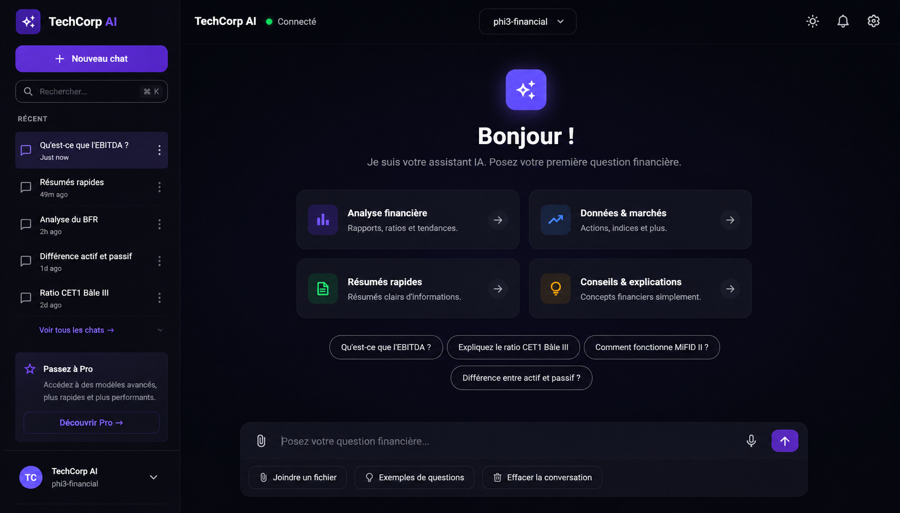
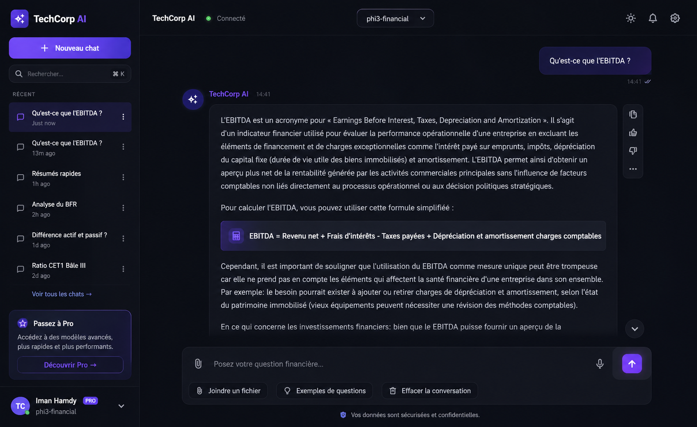

# TechCorp AI Chat

Specialized financial AI assistant based on **Ollama + Phi-3.5-Financial**, deployed without root access on Debian 13.
Interface available at **https://4ride.online**

Interfilière AI Challenge - Group B - YNOV Lyon 2026

---

## Interface

| Welcome screen | Conversation view |
|---|---|
|  |  |

---

## Quick access

| Protocol | URL | Usage |
|-----------|-----|-------|
| Local HTTP | `http://<LOCAL_IP>:11434` | Internal network only |
| Public HTTPS | `https://4ride.online` | External access via domain |

Model: **`phi3-financial`**

---

## Network architecture

```
Internet

4ride.online DNS A <PUBLIC_IP> (bbox public IP)

 Bbox (router) 
 Port 443 → 8443 
 Port 80 → 11434 

 <LOCAL_IP> (IA-SERVER, local network)

 Port 8443 Port 11434
 HTTPS Proxy (Python) Ollama (HTTP)
 scripts/https_proxy.py phi3-financial

 http://localhost:11434
```

---

## Ports

| Port | Service | Protocol | Accessible from |
|------|---------|-----------|-------------------|
| `11434` | Ollama (AI API) | HTTP | Local network only |
| `8443` | HTTPS Proxy | HTTPS | Local network + Internet (via router) |

> Port `8443` receives HTTPS connections, decrypts them with the SSL certificate, then forwards them to Ollama on port `11434` over local HTTP.

---

## DNS

The domain `4ride.online` points to the bbox's public IP via an **A-type DNS record**:

```
4ride.online. A <PUBLIC_IP>
```

The bbox then forwards traffic to this server (`<LOCAL_IP>`) via port forwarding rules.

> DNS resolution can take a few hours to propagate after a change.

---

## SSL / HTTPS

The SSL certificate is provided by **Let's Encrypt** via [acme.sh](https://github.com/acmesh-official/acme.sh).

- Files: `scripts/ssl/fullchain.pem` and `scripts/ssl/key.pem`
- Authority: Let's Encrypt (trusted by all browsers, no warnings)
- Validity: 90 days (automatic renewal via acme.sh)
- CN: `4ride.online`

**Obtain / renew the certificate:**
```bash
# First issuance (requires port 80 → 8080 on the router temporarily)
~/bin/acme.sh --issue -d 4ride.online --standalone --httpport 8080 --server letsencrypt

# Install into the proxy
~/bin/acme.sh --install-cert -d 4ride.online \
 --cert-file scripts/ssl/cert.pem \
 --key-file scripts/ssl/key.pem \
 --fullchain-file scripts/ssl/fullchain.pem
```

---

## Getting started

```bash
# 1. Deploy Ollama + model
cd /home/ia/techcorp-ai-chat
bash scripts/deploy_infra.sh

# 2. Start the HTTPS proxy (port 8443)
python3 scripts/https_proxy.py &

# 3. Validate the infrastructure
bash scripts/validate_infra.sh

# 4. Stop
bash scripts/stop_infra.sh
kill $(cat logs/https_proxy.pid)
```

---

## API - Endpoints

### Generate a response

```bash
curl -sk -X POST https://4ride.online/api/generate \
 -H "Content-Type: application/json" \
 -d '{"model":"phi3-financial","prompt":"What is EBITDA?","stream":false}'
```

### Chat (multi-turn)

```bash
curl -sk -X POST https://4ride.online/api/chat \
 -H "Content-Type: application/json" \
 -d '{
 "model": "phi3-financial",
 "messages": [{"role":"user","content":"Analyze this balance sheet..."}],
 "stream": false
 }'
```

### List models

```bash
curl -sk https://4ride.online/api/tags
```

> `-k` ignores the self-signed certificate warning.

---

## Scripts

| Script | Description |
|--------|-------------|
| `scripts/deploy_infra.sh` | Installs Ollama, downloads the model, creates `phi3-financial` |
| `scripts/stop_infra.sh` | Cleanly stops the Ollama server |
| `scripts/validate_infra.sh` | Runs the 6 infrastructure checkpoints |
| `scripts/https_proxy.py` | HTTPS → HTTP proxy to expose Ollama over HTTPS |

---

## Requirements

- Debian 13, Python 3.13+ (stdlib only, no external dependencies)
- OpenSSL (for certificate generation)
- Ollama installed at `~/bin/bin/ollama`
- Static curl at `~/bin/curl`

---

🇫🇷 [Lire en français](README.fr.md)
